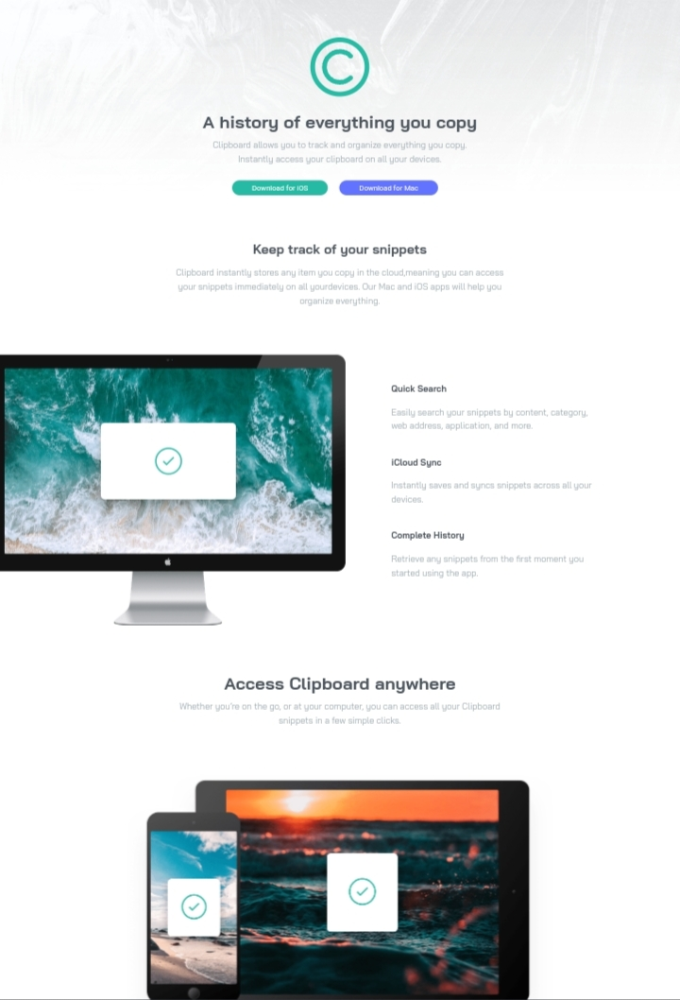
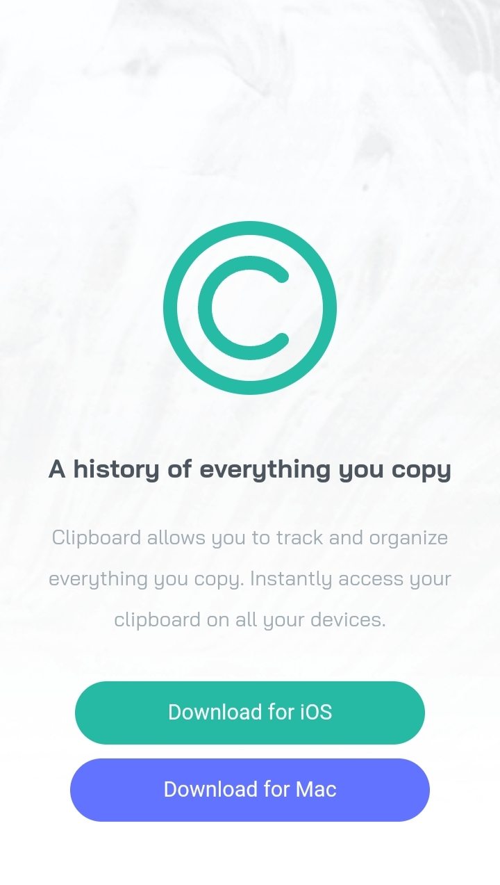

# Clipboard Landing Page

This is a solution to the [Clipboard landing page challenge on Frontend Mentor](https://www.frontendmentor.io/challenges/clipboard-landing-page-5cc9bccd6c4c91111378ecb9). Frontend Mentor challenges help you improve your coding skills by building realistic projects.

## Table of Contents

- [Overview](#overview)
  - [The Challenge](#the-challenge)
  - [Screenshots](#screenshots)
  - [Links](#links)
- [My Process](#my-process)
  - [Built With](#built-with)
  - [What I Learned](#what-i-learned)
  - [Continued Development](#continued-development)
  - [Useful Resources](#useful-resources)
- [Author](#author)
- [Acknowledgments](#acknowledgments)

## Overview

### The Challenge

The challenge was to create a landing page for a clipboard application that is responsive and follows the given design. Users should be able to view the optimal layout for the site depending on their device's screen size and see hover states for all interactive elements on the page.

### Screenshots

### Links

- Solution URL: [GitHub Repo](https://github.com/abrarishere/clipboardLandingWeb)
- Live Site URL: [Live Demo](https://abrarishere.github.io/clipboardLandingWeb/)

## My Process

### Built With

- HTML5
- CSS3
- Flexbox
- Grid Layout
- Responsive Design
- Mobile-first Approach

### What I Learned

During this project, I gained experience in implementing responsive design using Flexbox and Grid Layout. I also improved my skills in writing clean and semantic HTML and CSS code.

### Continued Development

In future projects, I aim to further enhance my skills in JavaScript to add interactivity and dynamic features to my web applications.

### Useful Resources

- [MDN Web Docs](https://developer.mozilla.org/) - For detailed documentation on HTML, CSS, and JavaScript.
- [CSS-Tricks](https://css-tricks.com/) - A great website for CSS tips, tricks, and tutorials.

## Author

- Website: [abrarishere.me](https://abrarishere.me)
- GitHub: [abrarishere](https://github.com/abrarishere)
- Twitter: [@abrarishere_](https://twitter.com/abrarishere_)

## Acknowledgments

I would like to thank Frontend Mentor for providing this challenge and allowing me to improve my frontend skills. Special thanks to [Insert Name], whose solution inspired me and helped me understand the project requirements better.

